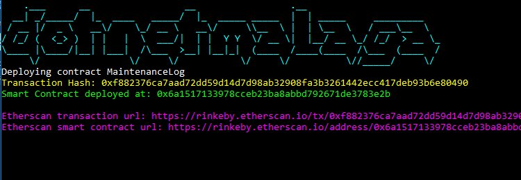
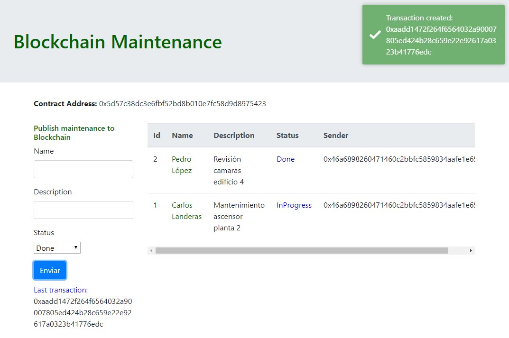

Source code for my talk:

> Developing decentralized applications in Ethereum with C# and Asp.Net Core

at Dotnet Malaga 2018

[http://dotnetmalaga.es/2018/](http://dotnetmalaga.es/2018/)

The repository contains two projects:

**smartcontract-deployment-client**

A net core console application that shows how to deploy a smart contract into Ethereum Rinkeby testnet using Infura gateway and your ethereum account private key. (You need to use a faucet like https://faucet.rinkeby.io/ to obtain test currency)

**ethereum-aspnet**

An Asp.Net Core Application serving a React SPA that allows the user interact with the deployed Ethereum smart contract by creating transactions.

**Console application**

** Asp.Net Core SPA**

